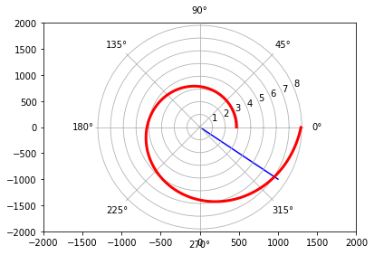
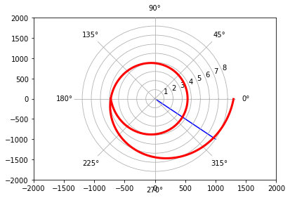

---
## Front matter
lang: ru-RU
title: Отчет по лабораторной работе №2
author: Deryabina Maria
institute: RUDN University, Moscow, Russian Federation
date: 13 February, 2021

## Formatting
mainfont: Times New Roman
romanfont: Times New Roman
sansfont: Times New Roman
monofont: Times New Roman
toc: false
slide_level: 2
theme: metropolis
header-includes:
 - \metroset{progressbar=frametitle,sectionpage=progressbar,numbering=fraction}
 - '\makeatletter'
 - '\beamer@ignorenonframefalse'
 - '\makeatother'
aspectratio: 43
section-titles: true
---

# Решение задачи о погоне

Я вывела дифференциальное уравнение для решения задачи о погоне и построила траекторию движения для двух случаев

## Первый случай

{#fig:001 width=70%}

## Второй случай

{#fig:002 width=70%}

