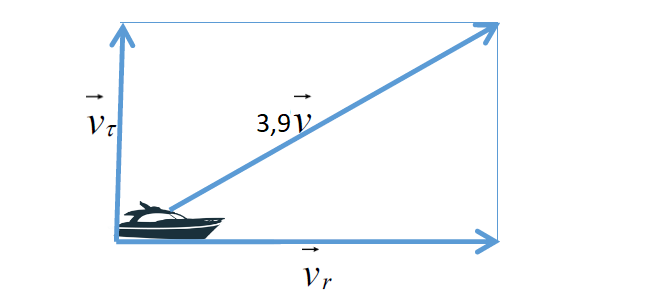
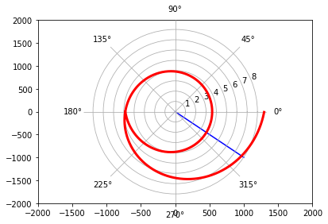

---
# Front matter
lang: ru-RU
title: "Отчёт по лабораторной работе"
subtitle: "Лабораторная №2"
author: "Дерябина Мария Сергеевна"

# Formatting
toc-title: "Содержание"
toc: true # Table of contents
toc_depth: 2
lof: true # List of figures
lot: true # List of tables
fontsize: 12pt
linestretch: 1.5
papersize: a4paper
documentclass: scrreprt
polyglossia-lang: russian
polyglossia-otherlangs: english
mainfont: Times New Roman
romanfont: Times New Roman
sansfont: Times New Roman
monofont: Times New Roman
mainfontoptions: Ligatures=TeX
romanfontoptions: Ligatures=TeX
sansfontoptions: Ligatures=TeX,Scale=MatchLowercase
monofontoptions: Scale=MatchLowercase
indent: true
pdf-engine: lualatex
header-includes:
  - \linepenalty=10 # the penalty added to the badness of each line within a paragraph (no associated penalty node) Increasing the value makes tex try to have fewer lines in the paragraph.
  - \interlinepenalty=0 # value of the penalty (node) added after each line of a paragraph.
  - \hyphenpenalty=50 # the penalty for line breaking at an automatically inserted hyphen
  - \exhyphenpenalty=50 # the penalty for line breaking at an explicit hyphen
  - \binoppenalty=700 # the penalty for breaking a line at a binary operator
  - \relpenalty=500 # the penalty for breaking a line at a relation
  - \clubpenalty=150 # extra penalty for breaking after first line of a paragraph
  - \widowpenalty=150 # extra penalty for breaking before last line of a paragraph
  - \displaywidowpenalty=50 # extra penalty for breaking before last line before a display math
  - \brokenpenalty=100 # extra penalty for page breaking after a hyphenated line
  - \predisplaypenalty=10000 # penalty for breaking before a display
  - \postdisplaypenalty=0 # penalty for breaking after a display
  - \floatingpenalty = 20000 # penalty for splitting an insertion (can only be split footnote in standard LaTeX)
  - \raggedbottom # or \flushbottom
  - \usepackage{float} # keep figures where there are in the text
  - \floatplacement{figure}{H} # keep figures where there are in the text
---

# Цель работы

Решить задачу о погоне. Вариант 37.

# Задание

1. Провести рассуждения и вывод дифференциальных уравнений в решении задачи о погоне, если скорость катера больше скорости лодки в 3,9 раз и лодка обнаружилась на расстоянии 19,1 км от катера.
2. Построить траекторию движения катера и лодки для двух случаев.
3. Определить по графику точку пересечения катера и лодки.

# Выполнение лабораторной работы

1. Чтобы найти расстояние x (расстояние после которого катер начнет двигаться вокруг полюса), необходимо составить простое уравнение. 
Пусть через время t катер и лодка окажутся на одном расстоянии x от полюса. 
За это время лодка пройдет x , а катер $k - x$ (или $k + x$, в зависимости от начального положения катера относительно полюса).
Время, за которое они пройдут это расстояние, вычисляется как $x/v$ или $k-x/3,9v$ (во втором случае  $x+k/3,9v$). Так как время одно и то же, то эти величины одинаковы.
Тогда неизвестное расстояние x можно найти из следующего уравнения:
- $\frac{x}{v} = \frac{k-x}{3,9v}$ в первом случае или
- $\frac{x}{v} = \frac{k+x}{3,9v}$ во втором.
Отсюда мы найдем два значения 
- $x1 = \frac{k}{4,9}$ ,
- $x2 = \frac{k}{2,9}$ задачу будем решать для двух случаев.

После того, как катер береговой охраны окажется на одном расстоянии от полюса, что и лодка, он должен сменить прямолинейную траекторию и начать двигаться вокруг полюса удаляясь от него со скоростью лодки v .
Для этого скорость катера раскладываем на две составляющие: радиальная скорость и тангенциальная скорость.
Радиальная скорость - это скорость, с которой катер удаляется от полюса, $v_{r}=\frac{dr}{dt}$.
Нам нужно, чтобы эта скорость была равна скорости лодки, поэтому полагаем $\frac{dr}{dt}=v$.
Тангенциальная скорость – это линейная скорость вращения катера относительно полюса. 
Она равна произведению угловой скорости $\frac{d\theta}{dt}$ на радиус: $v_{t}=\frac{rd\theta}{dt}$.

Скорость катера можно разложить на тангенциальную и радиальную(рис. -@fig:001)

{#fig:001 width=70%}

Из рисунка видно: $v_{t} = \sqrt{15,21v^{2} - v^{2}} = \sqrt{15,21}v$

Решение исходной задачи сводится к решению уравнения:
$\frac{dr}{d\theta} = \frac{r}{\sqrt{15,21}}$ с начльными условиями $\theta_{0}=0, r_{0}=x_{1}$ или $\theta_0=-\pi, r_{0}=x_{2}$

2. Построила траекторию движения катера и лодки для двух случаев(рис. -@fig:002, рис. -@fig:003).

{#fig:002 width=70%}

{#fig:003 width=70%}

# Вывод

Я научилась решать дифференциальные уравнения с помощью python, рисовать траектории движения в декартовых и полярных координатах.