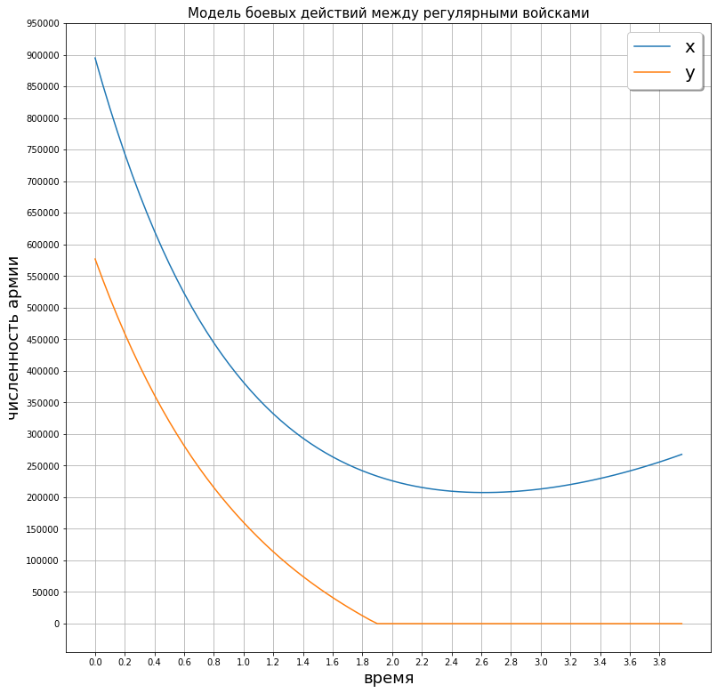
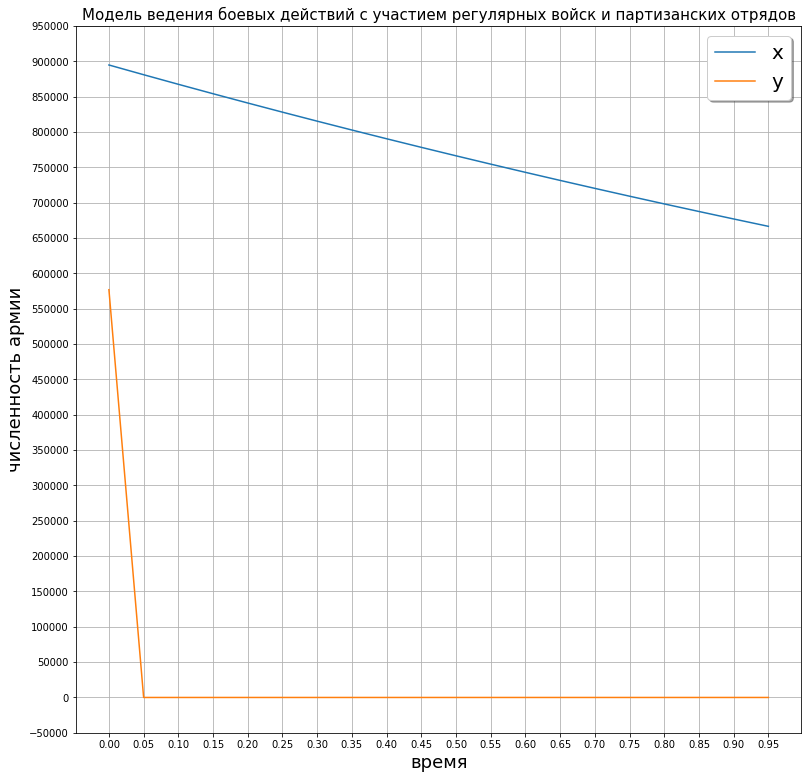

---
## Front matter
lang: ru-RU
title: Отчет по лабораторной работе №3
author: Deryabina Maria
institute: RUDN University, Moscow, Russian Federation
date: 13 February, 2021

## Formatting
mainfont: Times New Roman
romanfont: Times New Roman
sansfont: Times New Roman
monofont: Times New Roman
toc: false
slide_level: 2
theme: metropolis
header-includes:
 - \metroset{progressbar=frametitle,sectionpage=progressbar,numbering=fraction}
 - '\makeatletter'
 - '\beamer@ignorenonframefalse'
 - '\makeatother'
aspectratio: 43
section-titles: true
---

## Цель работы - анализ моделей боевых действий

Цель данной лабораторной работы - ознакомиться с простейшими моделями боевых действий,
научиться решать системы дифференциалных уравнений на языке Python.

## Задачи лабораторной работы  

Задачей данной лабораторной работы было построить две модели боевых действий:

1. Между регулярными армиями
2. Между ругулярным войском и партизанскими отрядами

# Результаты

## Первый случай

{#fig:001 width=70%}

## Второй случай

{#fig:002 width=70%}

## Выводы

Я рассмотрела различные модели боевых действий, научилась решать системы дифференциальных уравнений
на Python

