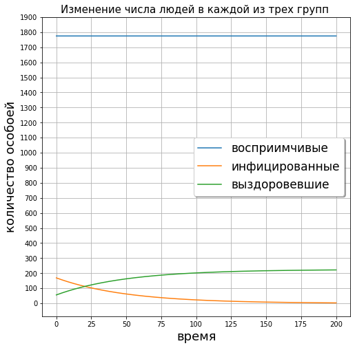
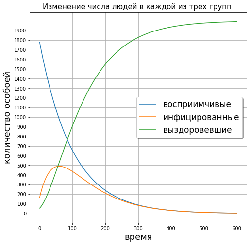

---
## Front matter
lang: ru-RU
title: Отчет по лабораторной работе №6
author: Deryabina Maria
institute: RUDN University, Moscow, Russian Federation
date: 13 February, 2021

## Formatting
mainfont: Times New Roman
romanfont: Times New Roman
sansfont: Times New Roman
monofont: Times New Roman
toc: false
slide_level: 2
theme: metropolis
header-includes:
 - \metroset{progressbar=frametitle,sectionpage=progressbar,numbering=fraction}
 - '\makeatletter'
 - '\beamer@ignorenonframefalse'
 - '\makeatother'
aspectratio: 43
section-titles: true
---

## Цель работы

Цель данной лабораторной работы - ознакомиться с моделью эпидемии.

## Задачи лабораторной работы  

Задачей данной лабораторной работы было построить графики данной модели для двух случаев:

1. если $I(0)<=I^{*}$. Все больные изолированны и не заражают здоровых
2. если $I(0)>I^{*}$. Инфицированные способны заражать восприимчивых
к болезни особей. 

## Модель

Изменение числа восприимчивых:

$\frac{dS}{dt}=\begin{cases} -aS, если I(t)>I^{*} \\ 0, если I(t)<=I^{*} \end{cases}$ 

Изменение числа инфицированных:

$\frac{dI}{dt}=\begin{cases} -aS - bI, если I(t)>I^{*} \\ -bI, если I(t)<=I^{*} \end{cases}$

Изменение числа выздоровевших:

$\frac{dI}{dt}=bI$

# Результаты

## Первый случай

{#fig:001 width=70%}

## Второй слчай

{#fig:002 width=70%}

## Выводы

Я изучила модель эпидемии, проанализировала изменение численности популяции в двух случаях, когда инфицированные изолированы
и когда происходит заражение восприимчивых.

