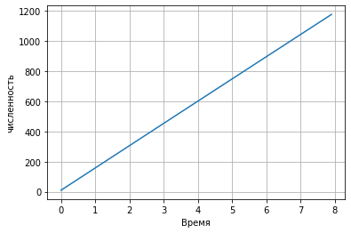
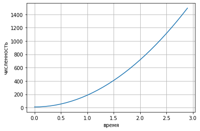
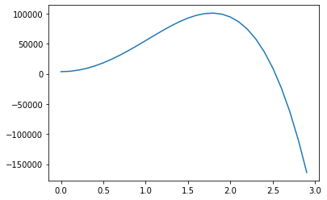
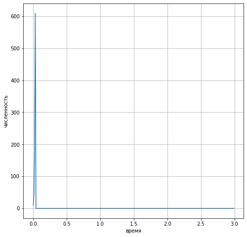

---
## Front matter
lang: ru-RU
title: Отчет по лабораторной работе №6
author: Deryabina Maria
institute: RUDN University, Moscow, Russian Federation
date: 13 February, 2021

## Formatting
mainfont: Times New Roman
romanfont: Times New Roman
sansfont: Times New Roman
monofont: Times New Roman
toc: false
slide_level: 2
theme: metropolis
header-includes:
 - \metroset{progressbar=frametitle,sectionpage=progressbar,numbering=fraction}
 - '\makeatletter'
 - '\beamer@ignorenonframefalse'
 - '\makeatother'
aspectratio: 43
section-titles: true
---

## Цель работы

Цель данной лабораторной работы - ознакомиться с моделью рекламной кампании.

## Модель

Математическая модель распространения рекламы описывается уравнением:

$$\frac{dn}{dt} = (\alpha _1(t) + \alpha _2(t)n(t))(N-n(t))$$

# Результаты

## Первый случай

{ #fig:001 width=70% height=70% }

## Второй слчай

{ #fig:002 width=70% height=70% }

## Скорость распространения для второго случая

{ #fig:003 width=70% height=70% }

## Третий случай

{ #fig:004 width=70% height=70% }

## Выводы

В ходе выполнения лабораторной работы была изучена модель эффективности рекламы и построены графики.

