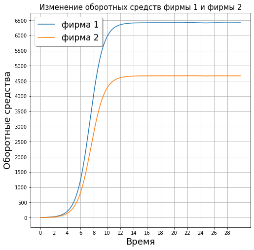
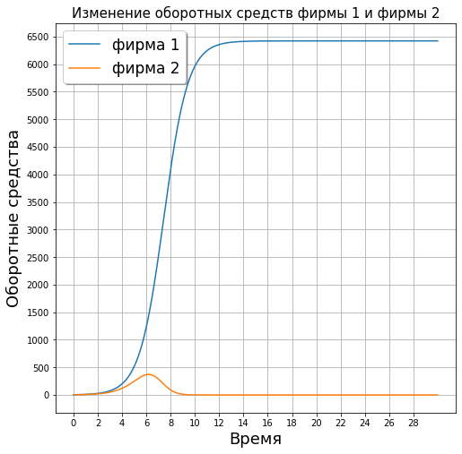

---
## Front matter
lang: ru-RU
title: Отчет по лабораторной работе №8
author: Deryabina Maria
institute: RUDN University, Moscow, Russian Federation
date: 13 February, 2021

## Formatting
mainfont: Times New Roman
romanfont: Times New Roman
sansfont: Times New Roman
monofont: Times New Roman
toc: false
slide_level: 2
theme: metropolis
header-includes:
 - \metroset{progressbar=frametitle,sectionpage=progressbar,numbering=fraction}
 - '\makeatletter'
 - '\beamer@ignorenonframefalse'
 - '\makeatother'
aspectratio: 43
section-titles: true
---

## Цель работы

Цели данной лабораторной работы 

- Рассмотреть модель фирмы, производящей продукт долговременного пользования, когда цена его определяется
балансом спроса и предложения. Примем, что этот продукт занимает
определенную нишу рынка и конкуренты в ней отсутствуют.

- Построить модель конкуренции двух фирм

## Модель

Функция спроса:

$$Q = q - k\frac{p}{S} = q(1 - \frac{p}{p_{cr}})$$

Уравнения динамики оборотных средств:

$$ \frac{dM}{dt} = -\frac{M \delta}{\tau} + NQp - k = -\frac{M\delta}{\tau} + Nq(1 - \frac{p}{p_{cr}})p - k $$

Уравнение для рыночной цены $p$ :

$$ \frac{dp}{dt} = \gamma (-\frac{M\delta}{\tau \widetilde{p}} + Nq(1-\frac{p}{p_{cr}}) ) $$

## Модель

При заданном M уравнение описывает быстрое стремление цены к равновесному значению цены, которое устойчиво. В этом случае уравнение можно заменить алгебраическим соотношением

$$ -\frac{M\delta}{\tau \widetilde{p}} + Nq(1-\frac{p}{p_{cr}}) = 0$$

Равновесное значение цены $p$ равно

$$ p = p_{cr}(1 - \frac{M\delta}{\tau \widetilde{p} Nq})$$

## Модель

Уравнения динамики оборотных средств

$$\frac{dM}{dt} = -\frac{M \delta}{\tau}(\frac{p}{p_{cr}}-1) - M^2 ( \frac{\delta}{\tau \widetilde{p} })^2 \frac{p_{cr}}{Nq} - k$$

Стационарное состояние

$$ \widetilde{M_{1,2}} = \frac{1}{2} a \pm \sqrt{\frac{a^2}{4} - b}$$

где

$$ a = Nq(1 - \frac{\widetilde{p}}{p_{cr}} \widetilde{p} \frac{\tau}{\delta}), b = kNq \frac{(\tau \widetilde{p})^2}{p_{cr}\delta ^2} $$

## Модель

При больших постоянных издержках (в случае $a^2 < 4b$) стационарных состояний нет.

При $b << a$ стационарные значения $M$ равны

$$ \widetilde{M_{+}} = Nq \frac{\tau}{\delta}(1 - \frac{\widetilde{p}}{p_{cr}})\widetilde{p}, \widetilde{M_{-}} = k\widetilde{p} \frac{\tau}{\delta(p_{cr} - \widetilde{p})} $$

## Задача

Рассмотрим две фирмы, производящие взаимозаменяемые товары
одинакового качества и находящиеся в одной рыночной нише. Считаем, что в рамках
нашей модели конкурентная борьба ведётся только рыночными методами. То есть,
конкуренты могут влиять на противника путем изменения параметров своего
производства: себестоимость, время цикла, но не могут прямо вмешиваться в
ситуацию на рынке («назначать» цену или влиять на потребителей каким-либо иным
способом.) Будем считать, что постоянные издержки пренебрежимо малы, и в
модели учитывать не будем

## Случай 1

$$ \frac{dM_1}{d\Theta} = M_1 - \frac{b}{c_1}M_1 M_2 - \frac{a1}{c1} M_1^2 $$

$$ \frac{dM_2}{d\Theta} = \frac{c_2}{c_1} M_2 - \frac{b}{c_1} M_1 M_2 - \frac{a_2}{c_1} M_2^2 $$

## Случай 1

{ #fig:001 width=70% height=70% }

## Случай 2

Рассмотрим модель, когда, помимо экономического фактора
влияния, используются еще и социально-психологические факторы –
формирование общественного предпочтения одного товара другому, не зависимо от
их качества и цены.

$$\frac{dM_1}{d\Theta} = M_1 - \frac{b}{c_1}M_1 M_2 - \frac{a1}{c1} M_1^2 $$

$$ \frac{dM_2}{d\Theta} = \frac{c_2}{c_1}M_2 - (\frac{b}{c_1} + 0.00063)M_1 M_2 - \frac{a_2}{c_1} M_2^2 $$

## Случай 2

{ #fig:002 width=70% height=70% }

## Выводы

В ходе выполнения лабораторной работы я изучила модель изменения оборотных средств фирмы и конкуренцию двух фирм. Я построила графики для разных случаев
изменения оборота.

